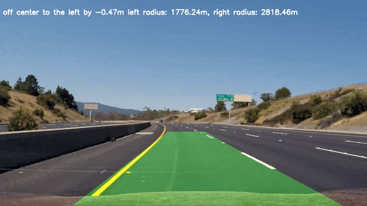
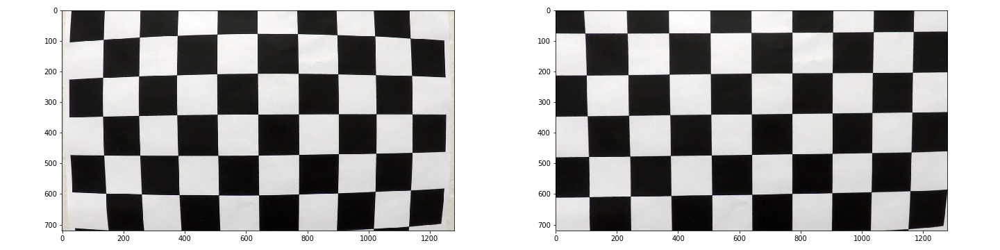
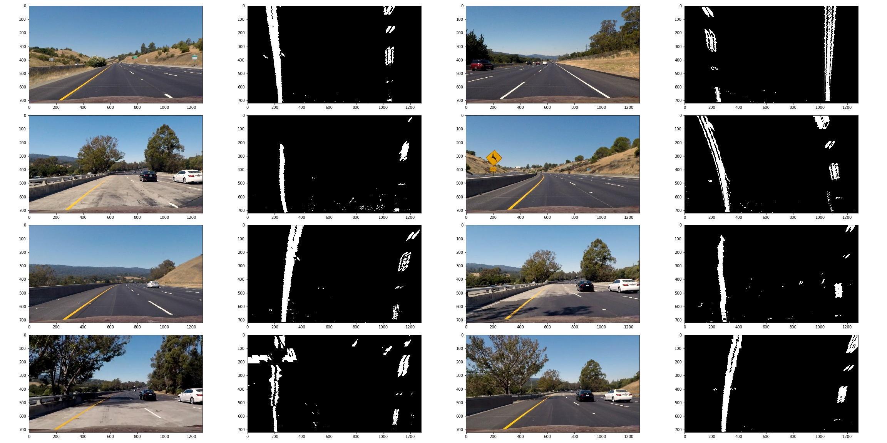
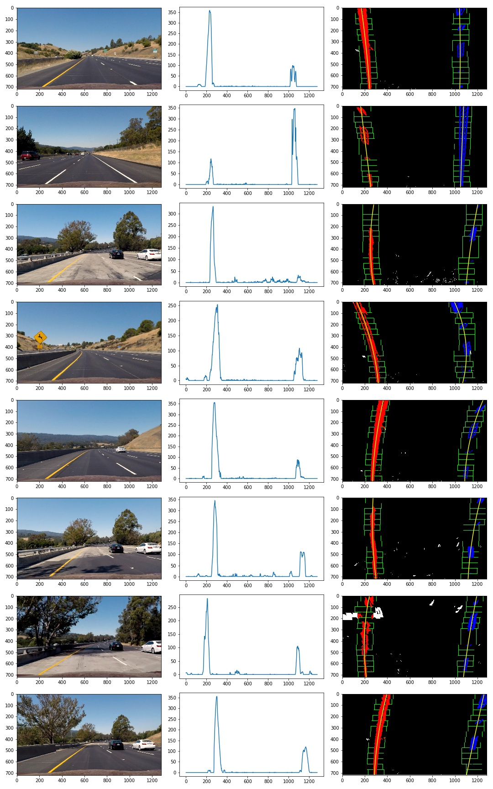
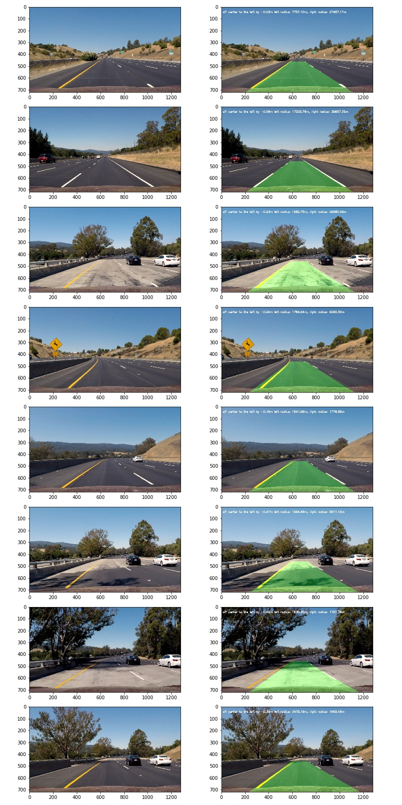

## Advanced Lane Finding
[](http://www.udacity.com/drive)

### Project Video


### Calibrate Camera
Apply `cv2.findChessboardCorners()` on [chessboard images](https://github.com/wengyao04/CarND-Advanced-Lane-Lines/tree/master/camera_cal) to identify corners as `imgpoints`, and save the corners of a horizontal chessbaord (size=9x5) in a 3D array `objpoints`.  `cv2.calibrateCamera()` is used to calculate the distortion coefficients and calibration matrix. The following images show the chessboard without/with calibration.



### Gradient Threshold
Pass gray scaled image to the cv2.Sobel() taht takes the derivative of the image in x or y direction. Taking the gradient in the x direction emphasizes edges closer to vertical. Alternatively, taking the gradient in the y direction emphasizes edges closer to horizontal. I try different thresholds to detect the lane lines, the combination of threshold on S channel (HLS) and threshold of applying Sobel operator in x direction gives a better performace.

| absolute sobel  | magnitude of sobel | direction of sobel | combined color threshold |
|:----------------:|:------------------:|:------------------:|:------------------:|
| abs(sobel_x) |  sqrt(sobel_x^2 + sobel_y^2) | arctan(sobel_y/sobel_x) | S-channel and abs(sobel_x) |


### Perspective Transform
Transform images as we view it from above. Apply `cv2.getPerspectiveTransform` on `source` and `destination` to get transform matrix. Then use `cv2.warpPerspective` to get the bird-eye view, see the following images
```
source = np.float32([[580, 460], [710, 460], [1150, 720], [150, 720]])
destination = np.float32([[200, 0], [1080, 0], [1080, 720], [200, 720]])
```



### Find the Lane Lines by Polynomial Fits
After applying calibration, a combined threshold and a perspective transform on a road image, take a histogram along all the columns in the lower half of the image:
```
import numpy as np
histogram = np.sum(img[img.shape[0]//2:,:], axis=0)
```
Two peaks in the histogram indicate the x-position of the base of the lane lines, which are used as start points for lines searching. From that point, I use a sliding window around the line centers and follow the lines up to the top of the frame.



### Apply Pipeline on Test Images
Define a class of Lines that keep x values and fitting parameters of last 5 fits. The best fitting parameters is the average of five saved fits. If best fitting exists, I skip sliding windows and search in a margin around the line positions which are calculated using best fitting parameters. In the sanity check, if the relative change of curvatures between previous and current lines is greater than 0.5, I reset data of Lines and will find line by sliding window procedure in the next image.
```
class Lines():
    def reset(self):
        # x values of the last n fits of the line n = 5
        self.recent_xfitted = []
        self.recent_fits = []
        #average x values of the fitted line over the last n iterations
        self.bestx = np.array([])
        #polynomial coefficients averaged over the last n iterations
        self.best_fit = np.array([])
        #radius of curvature of the line in some units
        self.radius_of_curvature = None
    
    def __init__(self, maxKeep=5):
        self.reset()
        self.maxKeep = maxKeep
```



### Project Output
[Project Video](##pipeline-video)
